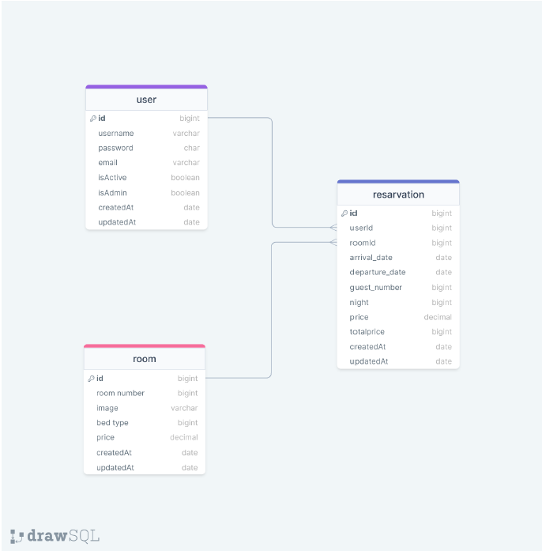

# HotelAPI

### ERD:



# Otel Rezervasyon Sistemi Görevleri

## Kullanıcı Modeli (User)

1. Kullanıcı Kaydı Oluşturma:

- [ ] Bir kullanıcı, sistemde yeni bir hesap oluşturabilir.
- [ ] Kullanıcı adı, şifre ve e-posta adresi gereklidir.
- [ ] Şifre en az 8 karakter uzunluğunda olmalı ve büyük/küçük harf, rakam ve özel karakter içermelidir.
- [ ] E-posta adresi geçerli bir formatta olmalıdır.
- [ ] Kullanıcı kaydedildiğinde şifre şifrelenmeli ve veritabanına öyle kaydedilmelidir.

```json
{
  "task": "Kullanıcı Kaydı",
  "data": {
    "username": "john_doe",
    "password": "Password123!",
    "email": "john_doe@example.com"
  }
}
```

2. Kullanıcı Girişi:

- [ ] Kayıtlı bir kullanıcı, username/email ve şifresi ile sisteme giriş yapar.
- [ ] Giriş yaparken, şifrenin doğruluğu kontrol edilmelidir.

```json
{
  "task": "Kullanıcı Girişi",
  "data": {
    "username": "john_doe",
    "password": "Password123!"
  }
}
```

or

```json
{
  "task": "Kullanıcı Girişi",
  "data": {
    "email": "john_doe@gmail.com",
    "password": "Password123!"
  }
}
```

3. Kullanıcı Bilgilerini Güncelleme

- [ ] Bir kullanıcı, kendi bilgilerini günceller (e-posta adresi veya şifre).
- [ ] Yeni şifre belirtilen kurallara uygun olmalıdır.
- [ ] E-posta adresi geçerli bir formatta olmalıdır.

```json
{
  "task": "Kullanıcı Bilgilerini Güncelleme",
  "data": {
    "userId": "60b6a9f1e1d1b24bfc13e0a8",
    "email": "new_email@example.com",
    "password": "NewPassword123!"
  }
}
```

## Oda Modeli (Room)

4. Oda Oluşturma

- [ ] Admin yetkisine sahip bir kullanıcı, sisteme yeni bir oda ekler.
- [ ] Oda numarası, yatak türü ve fiyat bilgileri gereklidir.
- [ ] Oda numarası benzersiz olmalıdır.

```json
{
  "task": "Oda Oluşturma",
  "data": {
    "roomNumber": 101,
    "image": "room101.jpg",
    "bedType": "Large Bed",
    "price": "150"
  }
}
```

5. Oda Bilgilerini Güncelleme

- [ ] Admin yetkisine sahip bir kullanıcı, var olan bir odanın bilgilerini günceller (fiyat, yatak türü vb.).
      Not: Oda ID'si gereklidir.

```json
{
  "task": "Oda Bilgilerini Güncelleme",
  "data": {
    "roomId": "60b6a9f1e1d1b24bfc13e0a9",
    "bedType": "Medium Bed",
    "price": "120"
  }
}
```

## Rezervasyon Modeli (Reservation)

6. Rezervasyon Oluşturma

- [ ] Bir kullanıcı, belirli bir tarihler arasında bir oda için rezervasyon yapar.
- [ ] Kullanıcı ID'si, oda ID'si, varış ve ayrılış tarihleri, misafir sayısı ve gece sayısı bilgileri gereklidir.
- [ ] Toplam fiyat gece sayısı ile oda fiyatının çarpımı olarak hesaplanmalıdır

```json
{
  "task": "Rezervasyon Oluşturma",
  "data": {
    "userId": "60b6a9f1e1d1b24bfc13e0a8",
    "roomId": "60b6a9f1e1d1b24bfc13e0a9",
    "arrivalDate": "2024-07-10",
    "departureDate": "2024-07-15",
    "guestNumber": 2,
    "night": 5,
    "price": 150
  }
}
```

7. Rezervasyon İptal Etme

- [ ] Bir kullanıcı, belirli bir rezervasyonu iptal eder.
      Not: Rezervasyon ID'si gereklidir

```json
{
  "task": "Rezervasyon İptal Etme",
  "data": {
    "reservationId": "60b6a9f1e1d1b24bfc13e0aa"
  }
}
```

## Ekstra Görevler

8. Kullanıcıları Listeleme

- [ ] Admin yetkisine sahip bir kullanıcı, sistemdeki tüm kullanıcıları listeler.

```json
{
  "task": "Kullanıcıları Listeleme"
}
```

9. Rezervasyonları Listeleme

- [ ] Admin yetkisine sahip bir kullanıcı, tüm rezervasyonları listeler.

```json
{
  "task": "Rezervasyonları Listeleme"
}
```

[View Postman Documentation](https://documenter.getpostman.com/view/32987022/2sA3e48oQX)
