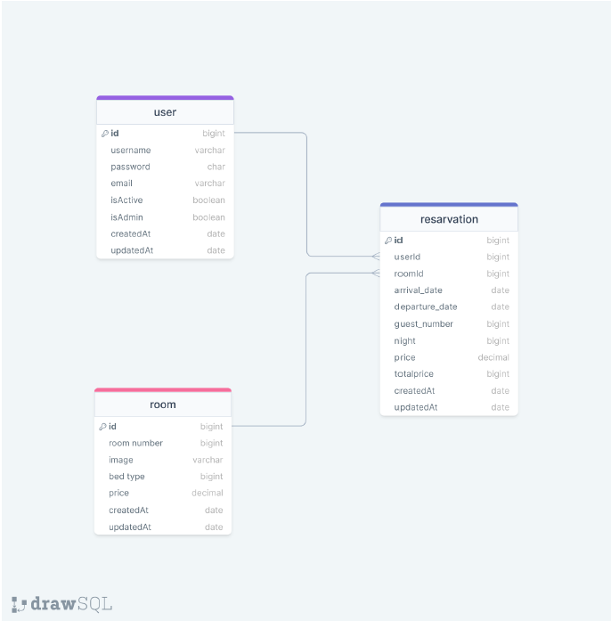

# HotelAPI
This document provides a comprehensive guide to the tasks and models required for a hotel reservation system. The system encompasses functionalities for user management, room management, and reservation management, ensuring a smooth and efficient process for both administrators and users.

### ERD:



# Hotel Reservation System Tasks

## User Model

1. User Registration:

- [ ] A user can create a new account in the system.
- [ ] A username, password, and email address are required.
- [ ] The password must be at least 8 characters long and contain uppercase/lowercase letters, numbers, and special characters.
- [ ] The email address must be in a valid format.
- [ ] When a user is registered, the password should be encrypted and stored in the database.

```json
{
  "task": "User Registration",
  "data": {
    "username": "john_doe",
    "password": "Password123!",
    "email": "john_doe@example.com"
  }
}
```

2. User Login:

- [ ] A registered user can log in with their username/email and password.
- [ ] The password should be verified upon login.

```json
{
  "task": "User Login",
  "data": {
    "username": "john_doe",
    "password": "Password123!"
  }
}
```

or

```json
{
  "task": "User Login",
  "data": {
    "email": "john_doe@gmail.com",
    "password": "Password123!"
  }
}
```

3. Update User Information:

- [ ] A user can update their own information (email address or password).
- [ ] The new password must comply with the specified rules.
- [ ] The email address must be in a valid format.

```json
{
  "task": "Update User Information",
  "data": {
    "userId": "60b6a9f1e1d1b24bfc13e0a8",
    "email": "new_email@example.com",
    "password": "NewPassword123!"
  }
}
```

## Room Model

4.  Create Room:

- [ ] A user with admin privileges can add a new room to the system.
- [ ] A room number, bed type, and price are required.
- [ ] The room number must be unique.

```json
{
  "task": "Create Room",
  "data": {
    "roomNumber": 101,
    "image": "room101.jpg",
    "bedType": "Large Bed",
    "price": "150"
  }
}
```

5. Update Room Information:

- [ ] A user with admin privileges can update the information of an existing room (price, bed type, etc.).
      Note: The room ID is required.

```json
{
  "task": "Update Room Information",
  "data": {
    "roomId": "60b6a9f1e1d1b24bfc13e0a9",
    "bedType": "Medium Bed",
    "price": "120"
  }
}
```

## Reservation Model

6. Create Reservation:

- [ ] A user can make a reservation for a room for specific dates.
- [ ] User ID, room ID, arrival and departure dates, guest number, and number of nights are required.
- [ ] The total price should be calculated by multiplying the number of nights by the room price.

```json
{
  "task": "Create Reservation",
  "data": {
    "userId": "60b6a9f1e1d1b24bfc13e0a8",
    "roomId": "60b6a9f1e1d1b24bfc13e0a9",
    "arrivalDate": "2024-07-10",
    "departureDate": "2024-07-15",
    "guestNumber": 2,
    "night": 5,
    "price": 150
  }
}
```

7. Cancel Reservation:

- [ ] A user can cancel a specific reservation.
      Note: The reservation ID is required.

```json
{
  "task": "Cancel Reservation",
  "data": {
    "reservationId": "60b6a9f1e1d1b24bfc13e0aa"
  }
}
```

## Additional Tasks

8. List Users:

- [ ] A user with admin privileges can list all users in the system.

```json
{
  "task": "List Users"
}
```

9. List Reservations:

- [ ] A user with admin privileges can list all reservations.

```json
{
  "task": "List Reservations"
}
```

## Documentations

[View Postman Documentation]()
[View Swagger Documentation]()
[View Redoc Documentation]()
[View Json Documentation]()
